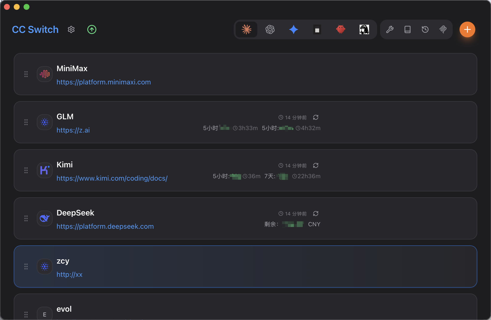
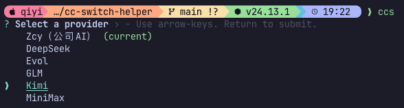

# cc-switch-helper

**[English](README.md)**

[CC-Switch](https://github.com/anthropics/cc-switch) 的命令行小工具 — 让不同终端窗口用不同 provider 跑 Claude Code。

它读取你在 CC-Switch 里配好的 provider，把对应的环境变量直接传给 `claude` 进程来启动。

## 为什么需要这个工具？

CC-Switch 管理 provider 确实方便，但切换是全局的 — 改了配置，所有 Claude Code 实例都跟着变。

`ccs` 换了个思路：把 provider 配置直接传给每个 `claude` 进程，不走全局配置。这样你可以在一个窗口用 DeepSeek，另一个窗口用 GLM，同时跑，互不影响。

```
窗口 1: ccs deep     → 用 DeepSeek 的 Claude Code
窗口 2: ccs glm      → 用 GLM 的 Claude Code
窗口 3: ccs zcy      → 用自定义 provider 的 Claude Code
```

每个窗口独立运行，切了一个，其他窗口完全不受影响。

<p align="center">
  
</p>

我的 cc-switch 配置长这样：

<p align="center">
  
</p>

## 功能

- **交互菜单** — 方向键选 provider，不用记名字
- **模糊匹配** — `ccs deep` 能匹配 "DeepSeek"，`ccs zcy` 匹配你的 ZCY provider
- **全平台** — macOS、Linux、Windows (PowerShell / CMD / Git Bash) 都能用
- **零配置** — 直接读 CC-Switch 的数据库

## 前置要求

1. 装了 [CC-Switch](https://github.com/anthropics/cc-switch)，并且至少配好一个 Claude provider
2. 装了 [Claude Code](https://docs.anthropic.com/en/docs/claude-code) CLI
3. [Node.js](https://nodejs.org/) ≥ 18

## 安装

```bash
npm install -g luckybilly/cc-switch-helper
```

装完之后全局就有 `ccs` 命令了。

## 用法

```
ccs                       # 交互选 provider
ccs <name>                # 模糊匹配 provider 名称
ccs <name> -- <args...>   # 给 claude 传额外参数
ccs --list                # 列出所有配好的 provider
ccs --help                # 看帮助
```

### 举例

```bash
# 弹出交互菜单选一个
ccs
```

<p align="center">
  
</p>

```bash
# 直接指定 provider（不区分大小写，模糊匹配）
ccs zcy
ccs DeepSeek
ccs glm

# 给 claude 传参数（-- 后面的都算）
ccs zcy -- --resume
ccs DeepSeek -- -p "hello world"

# 看看自己配了哪些 provider
ccs --list
```

### 别名 `cc`

嫌 `ccs` 太长，可以加个别名：

```bash
# ~/.zshrc 或 ~/.bashrc
alias cc=ccs
```

> **注意：** `cc` 在 macOS/Linux 上也是系统 C 编译器的名字。alias 在你的 shell 里优先级更高，但搞 C 项目的时候留意一下。

## 工作原理

1. 从 CC-Switch 的 SQLite 数据库读 provider 列表（`~/.cc-switch/cc-switch.db`）
2. 读你的 Claude 基础配置（`~/.claude/settings.json`）
3. 把选中 provider 的 `env` 和 `enabledPlugins` 合并进去
4. 执行 `claude --settings <json> --dangerously-skip-permissions`

provider 的环境变量会**覆盖**基础配置里的同名项，其他设置（权限、hooks、插件等）保持不变。

## 平台支持

| 平台 | Shell | 状态 |
|------|-------|------|
| macOS | zsh, bash | ✅ |
| Linux | bash, zsh, fish | ✅ |
| Windows | PowerShell | ✅ |
| Windows | CMD | ✅ |
| Windows | Git Bash | ✅ |

## License

MIT
